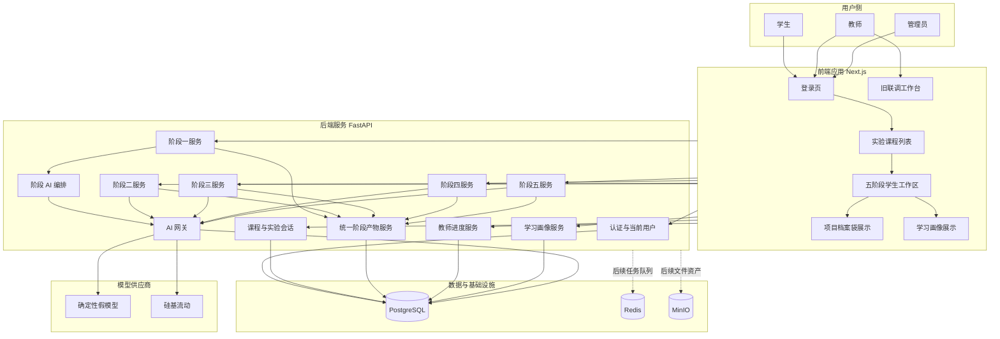
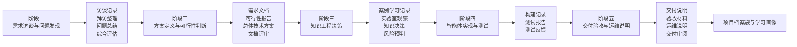
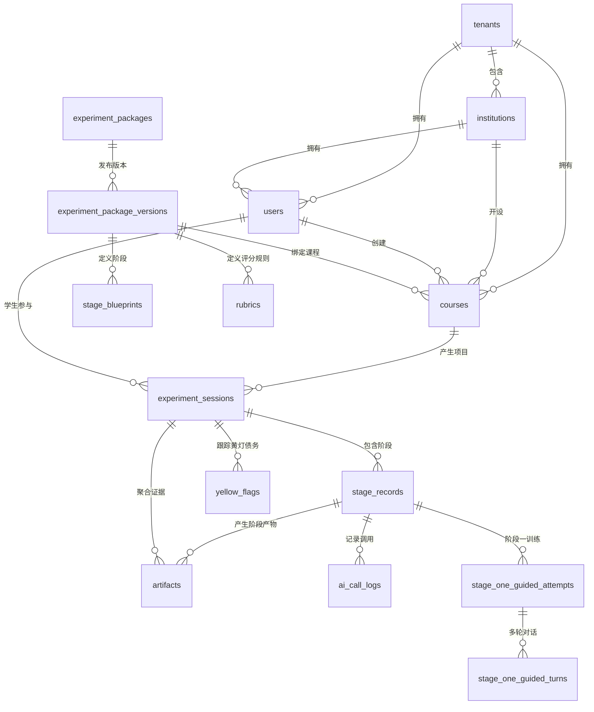
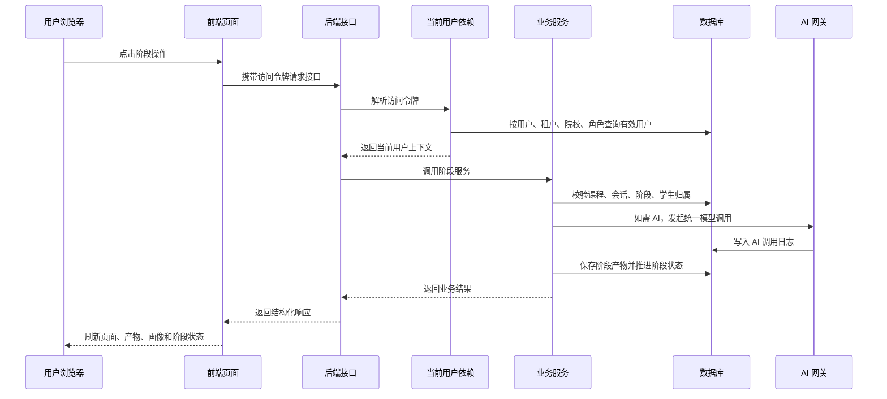

# EduFDE 项目阶段性复盘分析

> 日期：2026-05-28  
> 范围：当前仓库整体复盘，覆盖产品定位、技术栈、架构、目录结构、前端实现、后端实现、后端分模块、数据模型和数据库相关内容。  
> 依据：`AGENTS.md`、`docs/README.md`、v2.0 设计文档、`docs/dev/progress.md`、`docs/dev/decisions.md`、当前前后端代码与测试文件。

---

## 一、项目概述

EduFDE 是面向高校的 AI 智能体项目交付实训平台。平台目标不是让学生只完成一个“调用大模型”的练习，而是训练学生按真实项目交付链路完成 AI 智能体项目：

```text
需求访谈与问题发现
→ 方案定义与可行性判断
→ 知识工程决策
→ 智能体实现与测试
→ 交付验收与运维说明
```

当前项目已经完成 MVP 本地演示闭环，并完成正式学生端第一轮产品化迁移。系统已经具备以下基础能力：

- 学生端可以登录、查看实验课程、进入实验项目、按五阶段推进项目。
- 后端已经具备课程、实验会话、阶段状态、统一阶段产物、AI 调用日志和学习画像的基础链路。
- 阶段一已经从单纯 AI 客户访谈，扩展为教学引导模式和项目实战模式并存。
- 阶段二已经从单一方案表单升级为“需求文档 / 可行性报告 / 总体技术方案”的串行文档工作台。
- 阶段三已经具备知识工程决策、案例教学、五层知识实验室、风险预判和决策文档收口。
- 阶段四已经具备 Dify 路径下的构建记录、测试报告和 AI 测试反馈。
- 阶段五已经具备交付说明、验收材料、运维说明和 AI 交付审阅。
- 教师端目前保留基础进度视图，正式教师后台还未产品化。
- 学习画像目前是基于阶段状态和产物的规则即时计算，未持久化为正式画像表。

当前项目阶段可以概括为：

```text
已完成：MVP 闭环、本地演示、学生端正式产品骨架、真实模型供应商接入边界。
进行中：学生端产品化精修、阶段体验差异化、AI 评审结构化和证据链增强。
未完成：正式教师后台、课程成员权限、真实 Dify 深度接入、正式评分、黄灯债务闭环和生产部署。
```

### 1.1 当前最重要的架构地基

当前代码已经保留并局部实现以下长期地基：

- 课程绑定实验包版本，而不是只绑定实验包主记录。
- 所有阶段输出都保存为统一阶段产物。
- 阶段服务调用模型必须经过 AI 网关。
- 运行数据带有租户、院校、课程、实验会话和阶段作用域。
- AI 调用日志落库，阶段产物可保存对应调用编号。
- 评分规则、黄灯债务、学习画像、项目档案袋已经有基础或前端展示形态。
- 教师拥有最终教学判断权，AI 目前主要作为客户、导师、评审和反馈生成器。

### 1.2 当前主要不足

- 前端正式学生端虽然可运行，但页面和组件体量偏大，多个阶段组件超过千行。
- 前端已经安装了数据请求和状态管理依赖，但当前主要仍由页面级状态和手写请求函数驱动。
- 后端阶段一至阶段五服务存在大量相似的作用域校验、产物查询、状态推进和评分规则快照逻辑，后续需要抽出通用阶段运行服务。
- 教师读取权限仍以 `courses.created_by_user_id` 作为临时边界，还没有正式课程成员模型。
- 黄灯债务已经有数据表，并在阶段二生成部分风险记录，但跨阶段回应、确认和清除体验还不完整。
- 项目档案袋目前主要由前端从现有阶段产物聚合展示，后端还没有独立档案袋持久模型。
- 真实 Dify API、文件解析、向量库、正式后台、生产部署仍在后续阶段。

---

## 二、技术栈与项目架构分析

### 2.1 技术栈现状

| 层级 | 当前实现 | 说明 |
| --- | --- | --- |
| 前端应用 | Next.js App Router、React、TypeScript | 根路由承载正式学生端，`/dev-workbench` 保留旧联调工作台。 |
| 前端样式 | Tailwind CSS、少量自定义组件、lucide 图标 | 当前未正式接入 shadcn 组件库，但设计规格保留该方向。 |
| 前端数据访问 | 手写 `frontend/src/lib/api.ts` | 所有请求集中在一个文件中，统一拼接接口地址和鉴权头。 |
| 前端状态 | React 本地状态 | 已安装 React Query 和 Zustand，但正式页面尚未系统使用。 |
| 后端应用 | FastAPI | `backend/app/main.py` 注册所有业务路由。 |
| 数据模型 | SQLAlchemy 2.x | 模型按组织、身份、内容、教学运行、证据、AI 审计拆分。 |
| 数据迁移 | Alembic | 已有数据库地基、阶段蓝图、密码、阶段产物字段、会话修复、阶段一引导训练迁移。 |
| 数据库 | PostgreSQL | 本地通过 `docker-compose.yml` 启动。 |
| 缓存和任务基础 | Redis、Celery | 依赖已声明，当前业务链路尚未大量使用后台任务。 |
| 文件存储 | MinIO / S3 兼容存储 | Compose 已启动，本阶段文件上传解析链路尚未主线使用。 |
| AI 网关 | 内部模块 `backend/app/ai_gateway/` | 支持确定性假模型和硅基流动真实模型供应商。 |
| AI 编排 | `backend/app/ai_runtime/` + LangGraph | 当前主要用于阶段一客户与反馈流程。 |
| 测试 | Pytest、Node 原生测试、ESLint、TypeScript 检查 | 后端覆盖主要服务和接口；前端重点覆盖阶段流程纯逻辑。 |

### 2.2 总体目录结构

```text
.
├── backend/                         后端服务
│   ├── alembic/                     数据库迁移
│   ├── app/
│   │   ├── ai_gateway/              AI 网关：供应商、请求响应、调用日志
│   │   ├── ai_runtime/              阶段 AI 编排，目前重点是阶段一
│   │   ├── api/                     接口层
│   │   ├── core/                    配置与安全工具
│   │   ├── db/                      数据库连接
│   │   ├── models/                  数据模型
│   │   ├── schemas/                 请求和响应结构
│   │   ├── seeds/                   演示数据种子
│   │   └── services/                业务服务层
│   ├── scripts/                     运维和本地脚本
│   └── tests/                       后端测试
├── frontend/                        前端应用
│   ├── app/                         页面入口
│   │   ├── page.tsx                 正式学生端主入口
│   │   └── dev-workbench/page.tsx   旧联调工作台
│   └── src/
│       ├── components/
│       │   ├── student-product/     正式学生端组件
│       │   └── student-workspace/   旧联调工作台组件
│       └── lib/                     请求函数和配置
├── docs/                            v2.0 产品、架构和开发治理文档
├── reference_demo/                  阶段三知识实验参考演示
├── docker-compose.yml               本地依赖服务
├── .env.example                     本地环境变量模板
└── AGENTS.md                        Codex 开发会话指南
```

### 2.3 代码规模观察

当前前端正式学生端组件体量较大，说明产品化迭代已经进入复杂交互阶段：

| 文件 | 大致行数 | 说明 |
| --- | ---: | --- |
| `frontend/app/page.tsx` | 1189 | 正式学生端主编排，负责登录、课程、会话、阶段操作和数据刷新。 |
| `frontend/app/dev-workbench/page.tsx` | 1318 | 旧联调工作台，保留完整五阶段低层联调能力。 |
| `student-product/experiment-workspace.tsx` | 1278 | 五阶段正式工作区壳、阶段导航、上下文栏和阶段切换。 |
| `student-product/stage-one-workspace.tsx` | 1945 | 阶段一教学引导、项目实战、总结和评估。 |
| `student-product/stage-two-workspace.tsx` | 1351 | 阶段二三份文档串行工作台。 |
| `student-product/stage-three-workspace.tsx` | 1647 | 阶段三主页、案例、实验室、项目决策和风险文档。 |
| `student-product/stage-four-workspace.tsx` | 2286 | 阶段四 Dify 构建与测试核心工作台。 |
| `student-product/stage-five-workspace.tsx` | 1474 | 阶段五交付、验收、运维和收口。 |
| `frontend/src/lib/api.ts` | 1090 | 前端请求类型和调用函数全集中在一个文件。 |

这不是错误，但已经提示下一阶段需要开始做“可维护性整理”：按阶段工作流、表单草稿、评审展示、门禁计算、页面布局进一步拆分。

---

## 三、平台架构图

### 3.1 当前实现架构



### 3.2 五阶段教学证据链



### 3.3 数据关系主图



### 3.4 请求处理和作用域校验



---

## 四、目前前端实现详细分析

### 4.1 前端入口和页面形态

当前前端有两个主要入口：

| 入口 | 文件 | 当前职责 |
| --- | --- | --- |
| `/` | `frontend/app/page.tsx` | 正式学生端产品入口，包含登录、课程列表、五阶段工作区、学习画像、项目档案袋。 |
| `/dev-workbench` | `frontend/app/dev-workbench/page.tsx` | 旧联调工作台，保留学生五阶段、教师进度、学习画像等低层操作。 |

`frontend/app/page.tsx` 当前负责：

- 从浏览器本地存储恢复访问令牌。
- 登录演示账号并保存访问令牌。
- 调用当前用户接口判断角色。
- 对学生加载课程、实验会话、阶段产物、学习画像和阶段一引导训练记录。
- 对教师和管理员显示正式页面待开放提示。
- 编排阶段一至阶段五所有保存、评审、完成和刷新动作。
- 切换课程列表、实验工作区、学习画像和项目档案袋视图。

这说明正式学生端已经具备完整路径，但主页面承担了较重的流程编排职责。

### 4.2 正式学生端组件结构

正式学生端主要组件位于 `frontend/src/components/student-product/`：

| 组件或文件 | 主要职责 |
| --- | --- |
| `app-shell.tsx` | 正式学生端应用壳、顶栏、全局布局。 |
| `login-screen.tsx` | 登录页和演示角色选择。 |
| `course-list.tsx` | 实验课程列表、继续项目入口、进度概览。 |
| `experiment-workspace.tsx` | 五阶段实验工作区壳，负责阶段导航、阶段主页、右侧上下文和阶段组件切换。 |
| `stage-one-workspace.tsx` | 阶段一需求访谈工作区，包含教学引导、项目实战、总结和评估。 |
| `stage-two-workspace.tsx` | 阶段二文档工作台，包含三份正式文档和小节级评审。 |
| `stage-three-workspace.tsx` | 阶段三知识工程主页和各专注子视图入口。 |
| `stage-three-case-teaching-view.tsx` | 阶段三预置案例教学。 |
| `stage-three-rag-lab-view.tsx` | 阶段三五层知识实验室。 |
| `stage-four-workspace.tsx` | 阶段四 Dify 构建与测试工作台。 |
| `stage-five-workspace.tsx` | 阶段五交付、验收、运维和交付审阅。 |
| `learning-profile-view.tsx` | 正式学生端学习画像展示。 |
| `project-portfolio-view.tsx` | 项目档案袋展示。 |
| `terminology.ts` | 把内部字段、阶段键、产物类型和状态映射为中文业务文案。 |
| `ui.tsx` | 少量基础 UI 元件。 |

### 4.3 前端业务流程

正式学生端主要流程如下：

```text
登录
→ 读取当前用户
→ 如果是学生，读取课程和实验会话
→ 进入课程列表或直接恢复上次实验项目
→ 按五阶段读取阶段产物
→ 同步学习画像和阶段一引导训练记录
→ 学生在阶段工作区内保存、请求评审、完成阶段
→ 每次关键操作后重新拉取实验会话、阶段产物、学习画像
```

### 4.4 阶段一前端实现

阶段一当前是产品化程度最高的阶段之一，包含两条路径：

- 教学引导模式：通过六个关卡训练访谈能力，记录训练轮次，不写正式阶段产物。
- 项目实战模式：学生与 AI 客户进行正式拜访，保存访谈记录、拜访间整理、问题发现总结和综合评估。

前端相关文件：

- `stage-one-workspace.tsx`
- `stage-one-flow.ts`
- `stage-one-flow.test.ts`
- `stage-one-layout.ts`

当前特点：

- 使用专门的流程纯逻辑文件处理对话记录、客户身份、进度条、模式判断和产物计数。
- 引导训练和项目实战在体验上区分，符合“教学训练不污染正式项目产物”的边界。
- 项目实战产物会成为阶段二输入证据。
- 前端仍需继续精修正式客户拜访、多轮上下文、待追问问题和阶段二证据交接。

### 4.5 阶段二前端实现

阶段二已经从“单一方案表单”升级为文档式工作台：

- 需求文档
- 可行性报告
- 总体技术方案

每份文档由三个小节组成。学生先填写小节草稿，请求小节级追问和反馈，再提交小节，最后合成正式文档并请求文档级评审。

前端相关文件：

- `stage-two-workspace.tsx`
- `stage-two-flow.ts`
- `stage-two-flow.test.ts`

当前特点：

- 主页和专注核心操作区分离。
- 核心操作区隐藏五阶段全局主线，降低干扰。
- 右侧面板展示 AI 导师、门禁、追问问题、风险和建议。
- 已经做了中文化渲染，避免直接向学生展示后端字段名或原始结构。
- 阶段二已经开始使用黄灯风险摘要，但完整黄灯债务确认和跨阶段回应仍需后续补齐。

### 4.6 阶段三前端实现

阶段三包含多个差异化学习和实践模块：

- 阶段三主页和入口项。
- 预置案例教学。
- 五层知识实验室。
- 项目知识工程决策。
- 风险预判与决策文档。

前端相关文件：

- `stage-three-workspace.tsx`
- `stage-three-flow.ts`
- `stage-three-case-teaching.ts`
- `stage-three-case-teaching-view.tsx`
- `stage-three-rag-lab.ts`
- `stage-three-rag-lab-view.tsx`
- `stage-three-process-records.ts`
- `stage-three-project-decision.ts`
- `stage-three-risk-document.ts`
- 对应的测试文件。

当前特点：

- 阶段三开始明显脱离传统表单，具备实验台和教学案例形态。
- 五层知识实验室在前端本地模拟文档分块、向量召回、关键词召回和混合检索结果。
- 项目决策页会承接阶段二总体技术方案和五层实验室观察。
- 风险文档页会派生风险预判矩阵、提交前检查和决策文档预览。
- 后端只保存过程产物和正式决策，不真正构建向量库。

### 4.7 阶段四前端实现

阶段四围绕 Dify 路径构建智能体，分为主页和核心工作台：

- Dify 新手村
- 知识库搭建
- 提示词与流程
- 应用提交
- 测试验收
- 阶段收口

前端相关文件：

- `stage-four-workspace.tsx`
- `stage-four-flow.ts`
- `stage-four-flow.test.ts`

当前特点：

- 核心工作台采用任务轨、中央编辑区、右侧质量门禁的结构。
- 构建记录不只是链接提交，还要求记录概念确认、知识库搭建、提示词与流程、阶段三决策遵循、访问检查和已知限制。
- 测试报告要求覆盖标准题、范围外题、多轮题等类别。
- 当前只是记录 Dify 构建与测试证据，没有真实调用 Dify API 自动检查应用。

### 4.8 阶段五前端实现

阶段五围绕最终交付材料组织：

- 交付说明书
- 验收材料
- 运维说明
- AI 交付审阅
- 最终项目档案袋

前端相关文件：

- `stage-five-workspace.tsx`
- `project-portfolio-view.tsx`

当前特点：

- 阶段五会承接阶段四构建记录和测试报告。
- 前端会把阶段四已有内容转成阶段五草稿，减少学生重复填写。
- 项目档案袋由现有五阶段产物聚合展示，尚未落为后端独立档案袋表。

### 4.9 前端数据访问层

`frontend/src/lib/api.ts` 是当前前端请求集中入口，包含：

- 登录、当前用户。
- 课程、实验会话。
- 教师进度、学习画像。
- 阶段一至阶段五所有保存、评审、完成接口。
- 通用阶段产物查询。
- 请求错误解析。

优点：

- 当前阶段集中维护，便于快速追踪接口。
- 类型定义和请求函数同处一处，便于联调。

风险：

- 文件已经超过千行。
- 类型、请求函数、阶段业务含义混在一起。
- 后续正式引入数据缓存、错误重试、局部刷新时，需要拆分成按业务域组织的请求模块。

### 4.10 前端测试

当前前端测试主要针对流程纯逻辑：

- `npm run test:stage-one`
- `npm run test:stage-two`
- `npm run test:stage-three`
- `npm run test:stage-four`
- `npm run typecheck`
- `npm run lint`

测试重点不是完整浏览器端到端，而是覆盖阶段流程计算、门禁、产物识别和实验逻辑。这与当前阶段吻合，但后续正式产品化后需要增加浏览器级回归测试。

---

## 五、目前后端实现详细分析

### 5.1 后端总体架构

后端采用模块化单体。整体分层如下：

```text
接口层 api/
  负责路径、请求体、响应体、错误状态码转换

业务服务层 services/
  负责权限作用域、阶段规则、状态流转、产物保存、AI 调用编排

结构定义 schemas/
  负责请求和响应结构

数据模型 models/
  负责数据库表结构和关系

AI 网关 ai_gateway/
  负责模型供应商、统一请求响应、调用日志

AI 运行时 ai_runtime/
  负责更复杂的阶段 AI 编排，目前重点是阶段一

数据库 db/
  负责连接、会话和模型基类

核心配置 core/
  负责环境变量、鉴权工具
```

`backend/app/main.py` 创建 FastAPI 应用，注册以下路由：

- 健康检查
- 认证
- 课程
- 实验会话
- 阶段产物
- 学习画像
- 阶段一
- 阶段二
- 阶段三
- 阶段四
- 阶段五
- 教师进度

### 5.2 后端配置

配置文件：`backend/app/core/config.py`

主要配置项：

- 应用名称和版本。
- 接口前缀。
- 前端来源，用于跨域。
- 数据库连接地址。
- 访问令牌密钥和过期时间。
- Redis 地址。
- S3/MinIO 地址和桶名。
- AI 供应商配置。
- 硅基流动地址、模型、客户模型、推理模型和超时时间。

当前默认 AI 供应商为 `siliconflow`。如果本地没有配置真实模型密钥，可以显式设置为 `fake`，用于确定性开发和测试。

### 5.3 认证与当前用户

相关文件：

- `backend/app/api/auth.py`
- `backend/app/api/deps.py`
- `backend/app/services/auth.py`
- `backend/app/core/security.py`
- `backend/app/models/identity.py`

当前能力：

- 邮箱密码登录。
- 密码使用 PBKDF2 哈希。
- 生成访问令牌。
- 解析访问令牌并查询有效用户。
- 当前用户上下文包含用户、租户、院校和角色。

关键安全边界：

- 后端不会只按用户编号查询当前用户。
- 访问令牌中的用户、租户、院校、角色必须共同匹配数据库中的有效用户。
- 业务服务继续在课程、会话和阶段层面做作用域校验。

### 5.4 课程与实验会话

相关文件：

- `backend/app/api/courses.py`
- `backend/app/services/courses.py`
- `backend/app/api/experiment_sessions.py`
- `backend/app/services/experiment_sessions.py`
- `backend/app/models/teaching.py`

当前能力：

- 教师可以创建和读取当前租户、院校下的课程。
- 课程必须绑定实验包版本。
- 学生可以基于可见课程创建自己的实验会话。
- 一个学生在同一课程下只能有一个实验会话。
- 创建实验会话时从实验包版本读取五个阶段蓝图，并初始化五条阶段记录。
- 阶段一初始为待开始，阶段二至阶段五初始为未解锁。

临时边界：

- 教师读取课程和学生进度目前以课程创建人为边界。
- 正式课程成员、助教、教研负责人权限还未实现。

### 5.5 统一阶段产物服务

相关文件：

- `backend/app/api/artifacts.py`
- `backend/app/services/artifacts.py`
- `backend/app/models/evidence.py`

当前能力：

- 创建阶段产物。
- 按实验会话和阶段读取产物列表。
- 读取单个阶段产物详情。
- 创建时写入租户、院校、课程、实验会话、阶段记录、阶段键和提交人。
- 学生只能访问自己的实验会话产物。
- 教师读取仍受课程创建人临时边界限制。

统一阶段产物是当前系统最重要的证据载体。五阶段业务服务都复用该服务保存正式产物、过程产物和 AI 反馈。

### 5.6 AI 网关

相关文件：

- `backend/app/ai_gateway/schemas.py`
- `backend/app/ai_gateway/providers.py`
- `backend/app/ai_gateway/service.py`
- `backend/app/models/ai.py`

当前能力：

- 定义统一 AI 请求和响应结构。
- 支持确定性假模型供应商。
- 支持硅基流动供应商，使用兼容聊天补全接口。
- 根据用途选择客户模型、推理模型或默认模型。
- 每次调用写入 AI 调用日志。
- 失败调用也会写入日志并抛出统一错误。
- 响应返回调用日志编号，阶段服务可写入阶段产物。

当前用途：

- 阶段一客户回复、问题反馈、综合评估。
- 阶段二小节评审、文档评审、可行性评审。
- 阶段三知识工程决策评审。
- 阶段四测试反馈。
- 阶段五交付审阅。

### 5.7 阶段一服务

相关文件：

- `backend/app/api/stage_one.py`
- `backend/app/services/stage_one.py`
- `backend/app/schemas/stage_one.py`
- `backend/app/ai_runtime/stage_one/customer_config.py`
- `backend/app/ai_runtime/stage_one/graphs.py`
- `backend/app/models/teaching.py`

当前能力：

- AI 客户正式访谈。
- 教学引导训练记录读取。
- 教学引导训练轮次创建。
- 教学引导关卡完成。
- 问题发现总结保存。
- 拜访间整理保存。
- 阶段一综合评估生成。
- 阶段一完成并解锁阶段二。

阶段一产物：

| 类型 | 说明 |
| --- | --- |
| `stage_1_interview_turn` | 正式项目实战访谈记录。 |
| `stage_1_problem_summary` | 问题发现总结，阶段一完成必需。 |
| `stage_1_visit_notes` | 拜访间整理。 |
| `stage_1_evaluation` | 阶段一综合评估。 |

阶段一专用表：

- `stage_one_guided_attempts`：记录一个实验会话下的引导训练尝试。
- `stage_one_guided_turns`：记录引导训练每一轮学生提问、客户回复和反馈。

设计亮点：

- 教学引导训练与正式项目产物分离。
- AI 客户使用运行时编排和客户行为守卫，避免角色漂移。
- 正式访谈保存为阶段产物，可进入阶段二证据链。

### 5.8 阶段二服务

相关文件：

- `backend/app/api/stage_two.py`
- `backend/app/services/stage_two.py`
- `backend/app/schemas/stage_two.py`

当前能力：

- 保存小节草稿。
- 请求小节级 AI 追问和反馈。
- 提交小节。
- 从小节合成正式文档。
- 保存需求文档。
- 保存可行性报告。
- 保存总体技术方案。
- 请求文档级 AI 评审。
- 保留旧版方案定义保存和可行性评审接口。
- 完成阶段二并解锁阶段三。
- 根据文档评审派生红灯和黄灯风险。
- 将黄灯风险写入 `yellow_flags` 表。

阶段二三份文档：

| 文档 | 小节 |
| --- | --- |
| 需求文档 | 背景与现状、痛点与目标、验收与约束 |
| 可行性报告 | 数据可行性、技术可行性、价值与综合建议 |
| 总体技术方案 | 知识库与智能体路线、数据流与部署方式、后续阶段交接 |

阶段二产物：

| 类型 | 说明 |
| --- | --- |
| `stage_2_section_draft` | 小节草稿。 |
| `stage_2_section_review` | 小节级 AI 追问和反馈。 |
| `stage_2_section_submission` | 小节提交记录。 |
| `stage_2_requirements_document` | 正式需求文档。 |
| `stage_2_feasibility_report` | 正式可行性报告。 |
| `stage_2_technical_solution` | 正式总体技术方案。 |
| `stage_2_document_review` | 文档级评审。 |
| `stage_2_solution_definition` | 旧版方案定义产物。 |
| `stage_2_ai_review` | 旧版可行性 AI 评审。 |

阶段二完成条件：

- 当前实现保留旧版和新版能力。正式产品侧重点已经转到三份正式文档。
- 完成时会检查正式文档和评审门槛，服务中仍兼容旧版阶段产物。

### 5.9 阶段三服务

相关文件：

- `backend/app/api/stage_three.py`
- `backend/app/services/stage_three.py`
- `backend/app/schemas/stage_three.py`

当前能力：

- 保存知识工程决策。
- 保存预置案例教学记录。
- 保存五层知识实验室观察记录。
- 请求知识工程决策 AI 评审。
- 完成阶段三并解锁阶段四。

阶段三产物：

| 类型 | 说明 |
| --- | --- |
| `stage_3_knowledge_decision` | 正式知识工程决策，阶段三完成必需。 |
| `stage_3_case_study_record` | 预置案例学习过程记录。 |
| `stage_3_lab_experiment_record` | 五层知识实验室观察过程记录。 |
| `stage_3_ai_review` | 知识工程决策 AI 评审，阶段三完成必需。 |

设计边界：

- 过程记录可以推进阶段三进入进行中，但不替代正式决策和评审。
- 阶段三 AI 评审会读取阶段二方案上下文。
- 当前不构建真实知识库、向量库或文档解析流水线。

### 5.10 阶段四服务

相关文件：

- `backend/app/api/stage_four.py`
- `backend/app/services/stage_four.py`
- `backend/app/schemas/stage_four.py`

当前能力：

- 保存 Dify 实现记录。
- 保存测试报告。
- 请求 AI 测试反馈。
- 完成阶段四并解锁阶段五。

阶段四产物：

| 类型 | 说明 |
| --- | --- |
| `stage_4_dify_implementation` | Dify 构建记录。 |
| `stage_4_test_report` | 测试报告。 |
| `stage_4_ai_test_review` | AI 测试反馈。 |

设计边界：

- 阶段四要求阶段三已完成。
- 测试报告要求已存在 Dify 实现记录。
- AI 测试反馈读取阶段三知识工程决策、阶段四构建记录和测试报告。
- 当前只记录 Dify 应用信息，不真实调用 Dify API 自动构建或验收。

### 5.11 阶段五服务

相关文件：

- `backend/app/api/stage_five.py`
- `backend/app/services/stage_five.py`
- `backend/app/schemas/stage_five.py`

当前能力：

- 保存交付说明。
- 保存验收材料。
- 保存运维说明。
- 请求 AI 交付审阅。
- 完成阶段五并将实验会话标记为已完成。

阶段五产物：

| 类型 | 说明 |
| --- | --- |
| `stage_5_delivery_document` | 交付说明书。 |
| `stage_5_acceptance_package` | 验收材料。 |
| `stage_5_operations_guide` | 运维说明。 |
| `stage_5_ai_delivery_review` | AI 交付审阅。 |

设计边界：

- 阶段五要求阶段四已完成。
- 验收材料要求已有阶段四构建记录和测试报告。
- AI 交付审阅读取阶段五三份材料和阶段四上下文。
- 完成阶段五后，实验会话状态进入已完成。

### 5.12 教师进度服务

相关文件：

- `backend/app/api/teacher_progress.py`
- `backend/app/services/teacher_progress.py`
- `backend/app/schemas/teacher_progress.py`
- `frontend/src/components/teacher-progress.tsx`

当前能力：

- 教师可查看自己创建课程下的学生实验进度。
- 可查看课程内实验会话、学生信息、阶段状态、阶段产物数量。
- 可按课程、实验会话、阶段查看阶段产物摘要。

当前限制：

- 只读。
- 未实现教师批改、正式评分、Rubric 打分和课程成员权限。
- 权限临时依赖课程创建人。

### 5.13 学习画像服务

相关文件：

- `backend/app/api/learning_profile.py`
- `backend/app/services/learning_profile.py`
- `backend/app/schemas/learning_profile.py`
- `frontend/src/components/student-product/learning-profile-view.tsx`
- `frontend/src/components/learning-profile.tsx`

当前能力：

- 按实验会话即时计算学习画像。
- 输出阶段状态、产物数量、AI 反馈数量、完成阶段数、完成比例、优势、风险和下一步建议。
- 学生只能读取自己的画像。
- 教师只能读取自己创建课程下学生的画像。

当前限制：

- 不持久化画像。
- 不使用真实 AI 画像生成。
- 不绑定教师评分或正式 Rubric 分数。

---

## 六、后端分模块详细解析与对应脚本

### 6.1 后端模块清单

| 模块 | 目录或文件 | 说明 | 当前成熟度 |
| --- | --- | --- | --- |
| 应用入口 | `backend/app/main.py` | 创建应用、注册路由、配置跨域。 | 已可用 |
| 配置 | `backend/app/core/config.py` | 读取环境变量和默认配置。 | 已可用 |
| 安全 | `backend/app/core/security.py` | 密码哈希、令牌生成和解析。 | MVP 可用 |
| 数据库 | `backend/app/db/` | 数据库引擎、会话和模型基类。 | 已可用 |
| 组织模型 | `backend/app/models/organization.py` | 租户、院校。 | 已落库 |
| 身份模型 | `backend/app/models/identity.py` | 用户、角色和登录身份。 | MVP 可用 |
| 内容模型 | `backend/app/models/content.py` | 实验包、版本、阶段蓝图、评分规则。 | 已落库 |
| 教学运行模型 | `backend/app/models/teaching.py` | 课程、实验会话、阶段记录、阶段一引导训练。 | 已落库 |
| 证据模型 | `backend/app/models/evidence.py` | 统一阶段产物、黄灯债务。 | 已落库 |
| AI 审计模型 | `backend/app/models/ai.py` | AI 调用日志。 | 已落库 |
| 请求响应结构 | `backend/app/schemas/` | 各接口输入输出结构。 | 已可用 |
| 业务服务 | `backend/app/services/` | 核心业务规则。 | MVP 至产品化迭代中 |
| AI 网关 | `backend/app/ai_gateway/` | 模型供应商、调用日志、统一入口。 | 已可用 |
| AI 运行时 | `backend/app/ai_runtime/` | 阶段一 AI 客户编排。 | 阶段一已使用 |
| 演示数据 | `backend/app/seeds/demo.py` | 初始化演示用户、课程、实验包和规则。 | 已可用 |
| 本地脚本 | `backend/scripts/` | 初始化演示数据和数据库检查。 | 已可用 |
| 测试 | `backend/tests/` | 后端接口和服务测试。 | 覆盖主要链路 |

### 6.2 数据库迁移脚本

当前 Alembic 迁移位于 `backend/alembic/versions/`：

| 迁移 | 作用 |
| --- | --- |
| `2ba7aadc5602_create_mvp_database_foundation.py` | 创建 MVP 数据库地基。 |
| `9b1f22f3c8a4_add_user_password_hash.py` | 为用户增加密码哈希字段。 |
| `82e61f25d0bf_add_stage_blueprints.py` | 增加阶段蓝图。 |
| `b4c2d6e8f901_add_artifact_stage_key.py` | 为阶段产物增加阶段键。 |
| `c1f4e9a2b7d3_repair_experiment_session_schema.py` | 修复实验会话相关结构。 |
| `d6a4f2c8b901_add_stage_one_guided_training.py` | 增加阶段一教学引导训练表。 |

常用命令：

```bash
.venv/bin/alembic upgrade head
.venv/bin/alembic check
```

### 6.3 本地脚本

| 脚本 | 作用 |
| --- | --- |
| `backend/scripts/init_demo_data.py` | 初始化或修复演示数据，包括租户、院校、用户、制造业质检实验包、课程、阶段蓝图和评分规则。 |
| `backend/scripts/check_db.py` | 检查数据库连接。 |

演示账号由 seed 脚本维护：

- `student@edufde.demo`
- `student2@edufde.demo`
- `teacher@edufde.demo`
- `admin@edufde.demo`

默认密码为 `EduFDE-demo-123`。

### 6.4 后端测试脚本

| 测试文件 | 覆盖范围 |
| --- | --- |
| `test_health.py` | 健康检查。 |
| `test_database_foundation.py` | 数据库地基。 |
| `test_auth.py` | 登录、当前用户和鉴权。 |
| `test_demo_seed.py` | 演示数据初始化。 |
| `test_courses_sessions.py` | 课程和实验会话。 |
| `test_artifacts.py` | 统一阶段产物。 |
| `test_ai_gateway.py` | AI 网关、供应商和调用日志。 |
| `test_stage_one.py` | 阶段一访谈、训练、总结和完成。 |
| `test_stage_two.py` | 阶段二文档、评审、黄灯和完成。 |
| `test_stage_three.py` | 阶段三决策、过程记录、评审和完成。 |
| `test_stage_four.py` | 阶段四构建、测试反馈和完成。 |
| `test_stage_five.py` | 阶段五交付、审阅和完成。 |
| `test_teacher_progress.py` | 教师进度视图。 |
| `test_learning_profile.py` | 学习画像。 |

常用命令：

```bash
.venv/bin/pytest backend/tests -q
.venv/bin/ruff check backend
```

---

## 七、数据存储模型和数据库相关分析

### 7.1 数据域划分

当前数据库模型基本按六个数据域组织：

| 数据域 | 已实现表 | 说明 |
| --- | --- | --- |
| 组织域 | `tenants`、`institutions` | 支撑租户和院校作用域。 |
| 身份域 | `users` | MVP 使用简单角色枚举。 |
| 内容域 | `experiment_packages`、`experiment_package_versions`、`stage_blueprints`、`rubrics` | 支撑实验包版本、阶段蓝图和评分规则。 |
| 教学运行域 | `courses`、`experiment_sessions`、`stage_records`、`stage_one_guided_attempts`、`stage_one_guided_turns` | 支撑课程、学生项目和阶段推进。 |
| 证据域 | `artifacts`、`yellow_flags` | 统一保存阶段产物和黄灯债务。 |
| AI 审计域 | `ai_call_logs` | 保存模型调用记录。 |

### 7.2 核心表说明

#### 7.2.1 租户表 `tenants`

作用：

- 代表长期交付和数据隔离边界。
- 当前演示环境通常只有一个默认租户。

关键字段：

- `id`
- `name`
- `slug`
- `created_at`
- `updated_at`

#### 7.2.2 院校表 `institutions`

作用：

- 代表院校组织边界。
- 从属于租户。

关键字段：

- `tenant_id`
- `name`
- `code`

约束：

- 同一租户下院校编码唯一。

#### 7.2.3 用户表 `users`

作用：

- 保存学生、教师、管理员。

关键字段：

- `tenant_id`
- `institution_id`
- `email`
- `password_hash`
- `full_name`
- `role`
- `is_active`

当前角色：

- `admin`
- `teacher`
- `student`

#### 7.2.4 实验包表 `experiment_packages`

作用：

- 保存实验包主记录，例如制造业质检 AI 智能体实验包。
- 可作为平台标准内容，也可绑定租户或院校。

关键字段：

- `tenant_id`
- `institution_id`
- `slug`
- `name`
- `package_type`
- `description`

#### 7.2.5 实验包版本表 `experiment_package_versions`

作用：

- 锁定某个实验包版本的内容清单。
- 课程绑定该表，而不是只绑定实验包主表。

关键字段：

- `package_id`
- `version`
- `title`
- `status`
- `content_manifest_json`
- `published_at`

#### 7.2.6 阶段蓝图表 `stage_blueprints`

作用：

- 定义某个实验包版本下的五阶段结构。
- 创建学生实验会话时从该表生成阶段记录。

关键字段：

- `package_version_id`
- `stage_key`
- `stage_order`
- `title`
- `description`
- `blueprint_json`

约束：

- 同一实验包版本下阶段键唯一。
- 同一实验包版本下阶段顺序唯一。

#### 7.2.7 评分规则表 `rubrics`

作用：

- 保存阶段评分规则。
- 当前 AI 评审会将评分规则快照写入产物内容。

关键字段：

- `package_version_id`
- `course_id`
- `stage_key`
- `name`
- `version`
- `total_score`
- `status`
- `rubric_json`

当前限制：

- 尚未实现正式评分项表、教师评分和成绩计算。

#### 7.2.8 课程表 `courses`

作用：

- 代表教师开设的一门实验课程。
- 必须绑定实验包版本。

关键字段：

- `tenant_id`
- `institution_id`
- `package_version_id`
- `created_by_user_id`
- `title`
- `code`
- `status`
- `starts_at`
- `ends_at`

约束：

- 同一院校下课程编码唯一。

当前临时权限：

- 教师读取学生进度时使用 `created_by_user_id` 判断课程归属。

#### 7.2.9 实验会话表 `experiment_sessions`

作用：

- 代表一个学生在一门课程中的完整项目过程。
- 是五阶段产物和学习画像的主聚合对象。

关键字段：

- `tenant_id`
- `institution_id`
- `course_id`
- `student_user_id`
- `package_version_id`
- `status`
- `started_at`
- `completed_at`

约束：

- 同一课程下同一学生只能有一个实验会话。

#### 7.2.10 阶段记录表 `stage_records`

作用：

- 记录一个实验会话下每个阶段的状态。

关键字段：

- `tenant_id`
- `institution_id`
- `course_id`
- `session_id`
- `stage_key`
- `stage_order`
- `status`
- `skipped_learning`
- `skipped_reason`
- `started_at`
- `submitted_at`
- `completed_at`

阶段状态：

- `locked`：未解锁。
- `not_started`：待开始。
- `in_learning`：学习中。
- `in_practice`：进行中。
- `submitted`：待评审。
- `revision_required`：需修改。
- `warning_confirmed`：附条件通过。
- `completed`：已完成。
- `skipped`：已跳过。

当前状态推进规则：

- 创建实验会话时阶段一待开始，阶段二至阶段五未解锁。
- 当前阶段完成后只解锁下一阶段。
- 阶段五完成后实验会话变为已完成。

#### 7.2.11 统一阶段产物表 `artifacts`

作用：

- 保存所有阶段正式产物、过程产物、AI 反馈和交付材料。
- 是项目档案袋、学习画像、教师查看和后续评分的共同输入。

关键字段：

- `tenant_id`
- `institution_id`
- `course_id`
- `session_id`
- `stage_record_id`
- `stage_key`
- `submitted_by_user_id`
- `artifact_type`
- `title`
- `content_json`
- `file_record_id`
- `version`
- `status`
- `submitted_at`
- `reviewed_at`

当前产物状态：

- `draft`
- `submitted`
- `reviewed`
- `accepted`
- `revision_required`

#### 7.2.12 黄灯债务表 `yellow_flags`

作用：

- 记录可带入后续阶段处理的风险或条件通过项。
- 当前阶段二服务已经能派生并写入部分黄灯记录。

关键字段：

- `tenant_id`
- `institution_id`
- `course_id`
- `session_id`
- `source_stage_record_id`
- `source_artifact_id`
- `cleared_by_artifact_id`
- `source_stage_key`
- `impact_stage_key`
- `flag_type`
- `severity`
- `description`
- `status`
- `acknowledged_by_student`
- `acknowledged_at`
- `teacher_confirmed`

当前状态：

- `open`
- `acknowledged`
- `carried_forward`
- `cleared`
- `waived_by_teacher`

当前限制：

- 表结构已具备，但前端完整确认、回应、清除和教师豁免流程还未形成闭环。

#### 7.2.13 AI 调用日志表 `ai_call_logs`

作用：

- 记录每次模型调用。
- 支撑审计、排错、成本统计和后续质量治理。

关键字段：

- `tenant_id`
- `institution_id`
- `course_id`
- `session_id`
- `stage_record_id`
- `user_id`
- `prompt_version_id`
- `usage_type`
- `provider`
- `model_name`
- `status`
- `request_metadata_json`
- `response_metadata_json`
- `prompt_tokens`
- `completion_tokens`
- `total_tokens`
- `latency_ms`
- `error_message`

当前限制：

- 真实 Prompt 版本还未落库。
- 成本统计和限流策略还未完整实现。

#### 7.2.14 阶段一引导训练表

`stage_one_guided_attempts`：

- 记录阶段一教学引导模式的一次训练尝试。
- 包含当前关卡、已完成关卡和训练状态。

`stage_one_guided_turns`：

- 记录每轮训练对话。
- 保存学生提问、客户回复、反馈、客户调用日志编号和反馈调用日志编号。

设计价值：

- 教学训练记录不写入正式阶段产物。
- 保证训练过程和正式项目证据链隔离。

### 7.3 数据关系和作用域规则

当前运行数据基本遵循以下链路：

```text
tenant
→ institution
→ course
→ experiment_session
→ stage_record
→ artifact / yellow_flag / ai_call_log
```

这条链路的价值：

- 能够支撑未来多租户和院校隔离。
- 能够让教师按课程读取学生项目。
- 能够让阶段产物与阶段状态、AI 调用记录关联。
- 能够让学习画像和项目档案袋从统一证据池聚合。

### 7.4 当前数据库和规划模型的差距

已实现：

- 租户、院校、用户。
- 实验包、实验包版本、阶段蓝图。
- 课程、实验会话、阶段记录。
- 统一阶段产物。
- 黄灯债务最小模型。
- 评分规则最小模型。
- AI 调用日志。
- 阶段一引导训练记录。

尚未实现或仅前端聚合：

- 正式课程成员模型。
- 平台级细粒度角色和权限。
- 部门、班级、课程选课关系。
- 文件记录和文件解析流水线。
- 评分项、教师评分、成绩结果。
- 独立 AI 评审表。
- 独立项目档案袋表。
- 独立学习画像表。
- Prompt 版本表和模型路由配置表。
- Token 成本流水和限流策略表。
- 审计日志和运维授权表。

---

## 八、当前实现质量评估

### 8.1 优势

- 产品主线清晰：五阶段链路已经贯穿前端、后端和数据库。
- 架构边界没有被 MVP 快速实现破坏：实验包版本、统一产物、AI 网关、租户院校作用域都已落地。
- 后端服务层对学生会话、阶段键、阶段顺序和作用域有明确校验。
- AI 调用不是散落在阶段服务中，而是统一经过 AI 网关并落日志。
- 正式学生端已经开始从“表单堆叠”转向“阶段专属学习体验”。
- 阶段二、阶段三和阶段四已经有较多流程纯逻辑测试，便于继续精修。
- 旧联调工作台未被删除，仍可作为底层接口验证入口。

### 8.2 风险

- 前端多个组件过大，后续修改容易引入视觉和状态回归。
- 前端主页面流程编排过重，数据获取、业务动作、视图切换和刷新策略耦合较强。
- 后端阶段服务重复代码较多，后续新增阶段规则和权限模型时维护成本会上升。
- 教师权限临时边界不能长期使用，否则无法支撑助教、课程共建、教研负责人等角色。
- 学习画像、项目档案袋、黄灯债务目前仍未达到正式教学闭环强度。
- 真实模型输出虽然已接入供应商边界，但各阶段结构化提示、红灯判断和证据绑定仍需继续增强。
- 文件存储、Redis、Celery、MinIO 等基础设施已引入，但当前主线使用较少，后续需要避免“有依赖无闭环”。

---

## 九、下一阶段建议

### 9.1 第一优先级：阶段一项目实战模式收口

建议继续围绕阶段一项目实战模式打磨：

- 正式客户拜访多轮上下文。
- 拜访间整理。
- 待追问问题池。
- 问题发现总结。
- 综合评估。
- 阶段二输入证据链。

目标是让阶段一从“能聊天、能保存”升级为“能训练真实需求访谈能力，并可靠产出阶段二输入”。

### 9.2 第二优先级：前端可维护性整理

建议不要立即大范围重构，而是在后续每个阶段精修时同步拆分：

- 把阶段组件中的表单草稿逻辑、门禁逻辑、评审摘要逻辑、布局组件分离。
- 将 `frontend/src/lib/api.ts` 拆成认证、课程会话、阶段一至五、教师、画像等请求模块。
- 在正式学生端逐步引入更稳定的数据刷新模式，减少页面级手动刷新分支。
- 为阶段核心用户路径增加浏览器回归测试。

### 9.3 第三优先级：后端阶段运行通用能力

建议抽象通用阶段运行服务，减少重复：

- 阶段作用域查询。
- 阶段键校验。
- 阶段是否可写。
- 上一阶段是否完成。
- 最新阶段产物查询。
- 评分规则快照。
- 当前阶段完成和下一阶段解锁。
- AI 评审产物创建。

这样能降低阶段二至阶段五继续升级时的重复风险。

### 9.4 第四优先级：黄灯债务闭环

当前黄灯债务已经具备表结构和阶段二生成逻辑，下一步可以形成产品闭环：

- 学生确认黄灯。
- 后续阶段显示待回应黄灯。
- 学生用后续产物回应黄灯。
- AI 或教师判断是否清除。
- 项目档案袋展示黄灯处理历史。

### 9.5 第五优先级：课程成员权限模型

需要将教师临时读取边界从课程创建人升级为课程成员：

- 教师、助教、教研负责人、学生加入课程。
- 不同角色拥有不同读写权限。
- 教师进度、学习画像、阶段产物读取统一使用课程成员关系。

---

## 十、阶段性结论

EduFDE 当前已经完成从“能跑通 MVP”到“具备正式学生端产品形态”的关键跃迁。项目的底层架构选择总体是稳的：模块化单体、实验包版本绑定、统一阶段产物、AI 网关、租户院校作用域和 AI 调用日志都已经在代码中落地。

下一阶段不宜继续横向铺大量新页面，而应围绕学生端真实教学体验做纵向精修：优先把阶段一项目实战模式和阶段二证据链打磨扎实，再逐步增强阶段二至阶段五的 AI 评审质量、黄灯债务闭环、项目档案袋和学习画像。同时，需要有节奏地整理前端大组件和后端阶段服务重复逻辑，为正式教师后台、课程成员权限、真实 Dify 集成和生产化部署打好基础。

---

## 十一、本次复盘覆盖文件

主要查阅和对照的文件包括：

- `AGENTS.md`
- `README.md`
- `docs/README.md`
- `docs/dev/progress.md`
- `docs/dev/decisions.md`
- `docs/dev/mvp-closure-review.md`
- `docs/EduFDE_终局总体方案设计_v2.0.md`
- `docs/EduFDE_平台架构与部署形态设计_v2.0.md`
- `docs/EduFDE_数据模型与权限治理设计_v2.0.md`
- `docs/EduFDE_AI能力与治理设计_v2.0.md`
- `docs/EduFDE_前端产品UI设计规格_v2.0.md`
- `frontend/app/page.tsx`
- `frontend/app/dev-workbench/page.tsx`
- `frontend/src/components/student-product/*`
- `frontend/src/components/student-workspace/*`
- `frontend/src/lib/api.ts`
- `backend/app/main.py`
- `backend/app/api/*`
- `backend/app/services/*`
- `backend/app/models/*`
- `backend/app/schemas/*`
- `backend/app/ai_gateway/*`
- `backend/app/ai_runtime/*`
- `backend/alembic/versions/*`
- `backend/scripts/*`
- `backend/tests/*`
