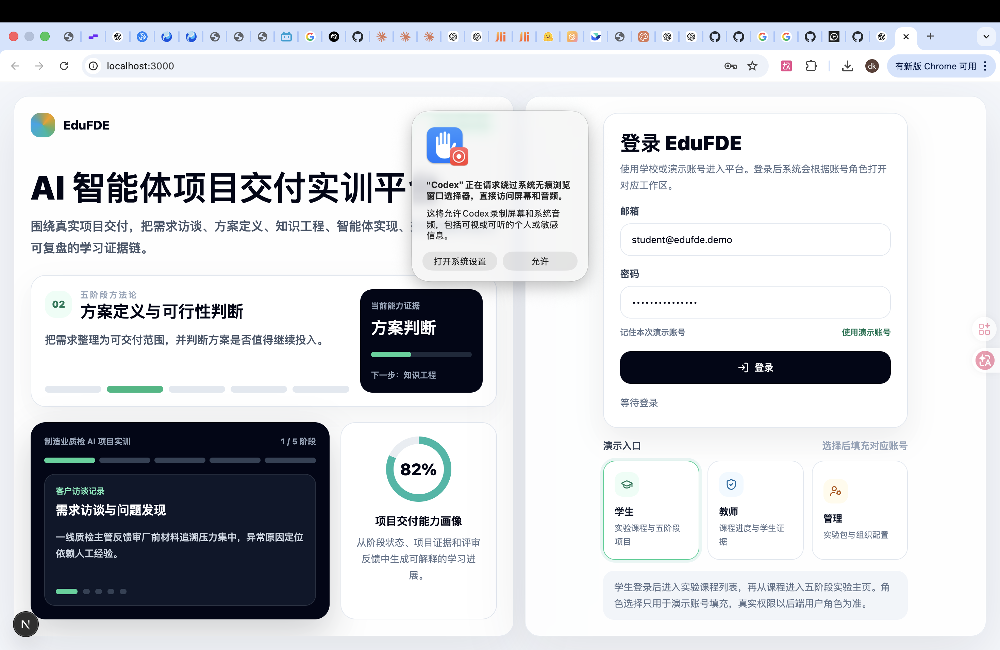
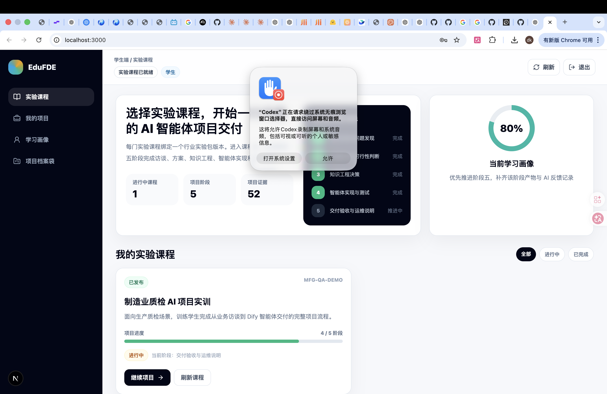
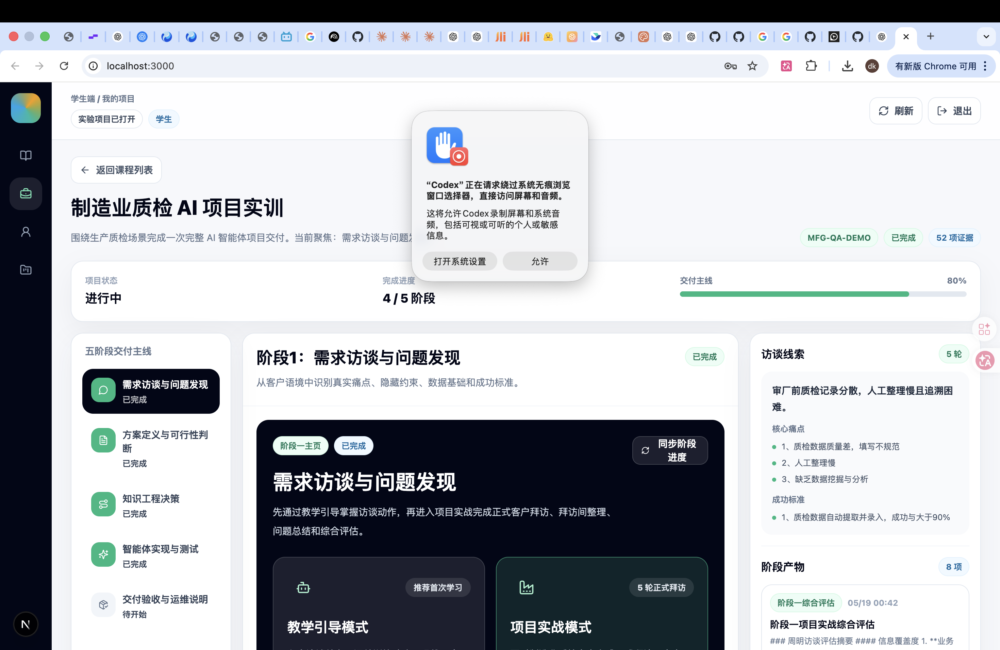
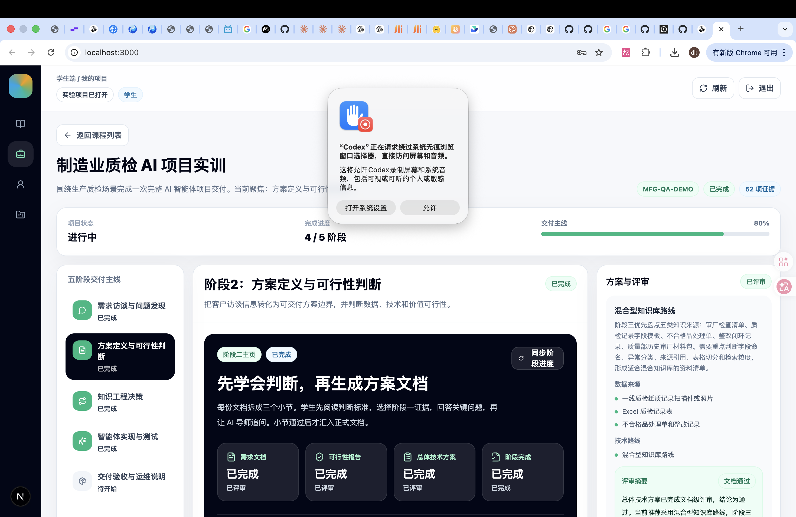
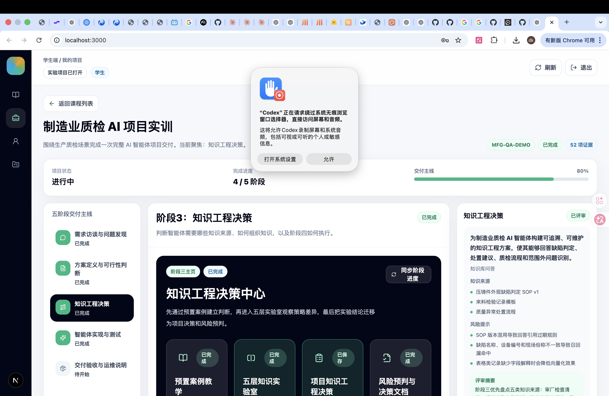
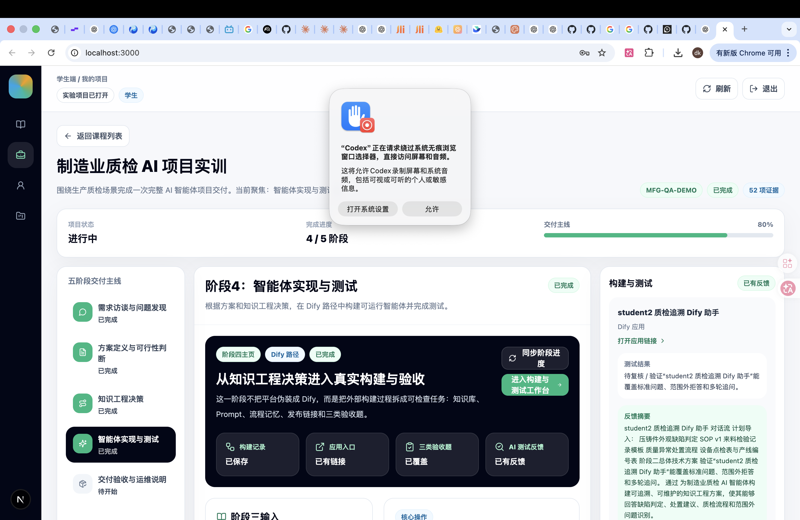
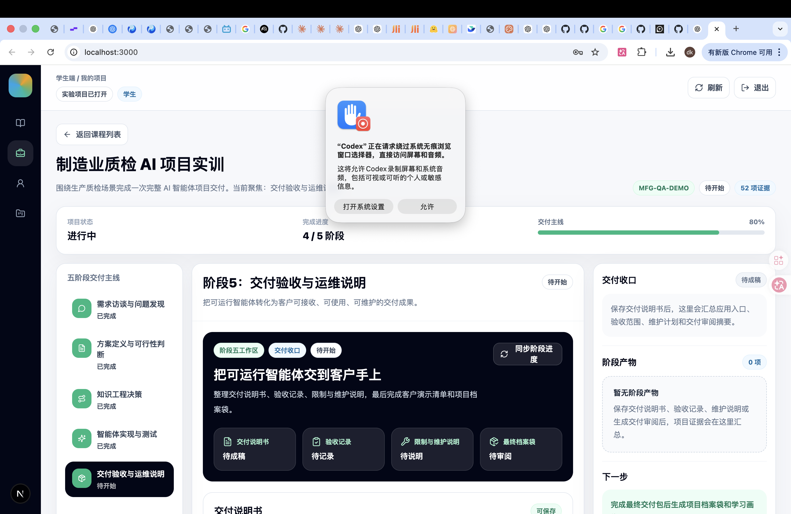
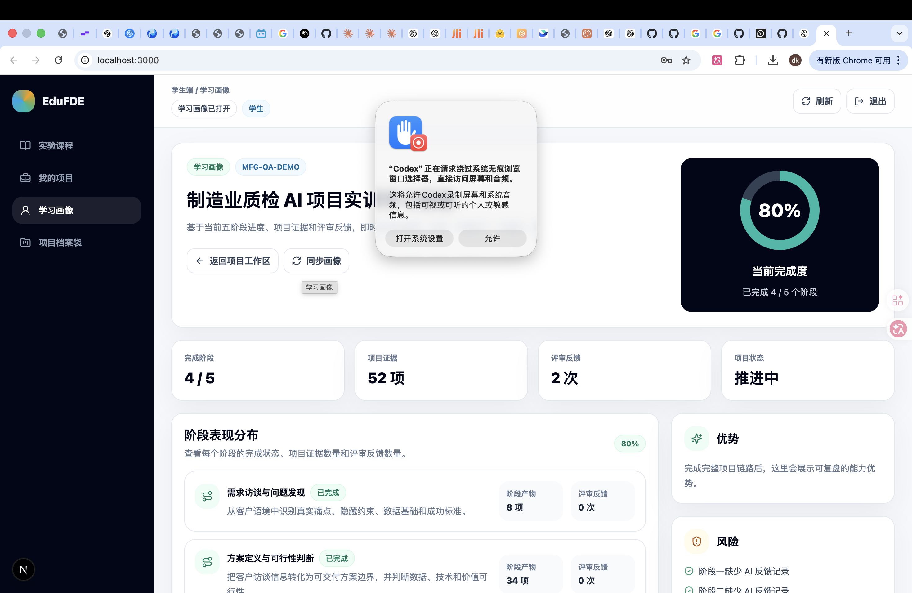
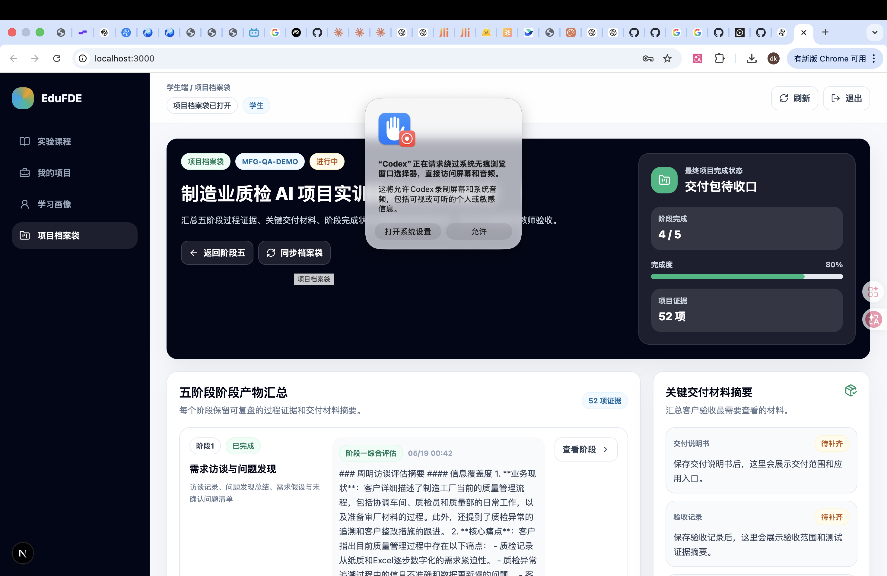

# student2 平台页面截图走查

采集时间：2026-05-28  
浏览器：Google Chrome  
访问地址：http://localhost:3000/  
登录账号：student2@edufde.demo  
截图文件像素尺寸：2940 x 1912（Google Chrome 视网膜屏截图）

## 01 登录页

登录页展示 EduFDE 平台定位、五阶段方法论动态卡片、演示账号入口和登录表单。本次从该页输入 `student2@edufde.demo` 并登录。

## 02 实验课程

学生登录后的课程列表页，展示当前实验课程、五阶段主线、学习画像摘要、课程进度和继续项目入口。

## 03 阶段一：需求访谈与问题发现

阶段一工作区展示教学引导模式、项目实战模式、正式访谈轮次、问题总结、综合评估和阶段产物。

## 04 阶段二：方案定义与可行性判断

阶段二工作区展示需求文档、可行性报告、总体技术方案、文档评审状态和阶段二产物摘要。

## 05 阶段三：知识工程决策

阶段三工作区展示预置案例教学、五层知识实验室、项目知识工程决策、风险预判与决策文档入口，以及知识来源和风险提示。

## 06 阶段四：智能体实现与测试

阶段四工作区展示 Dify 路径、构建记录、应用入口、三类验收题覆盖、AI 测试反馈，以及阶段三输入对阶段四的承接关系。

## 07 阶段五：交付验收与运维说明

阶段五工作区展示交付说明书、验收记录、限制与维护说明、客户演示与最终档案袋的收口入口。当前 student2 仍处于阶段五待开始状态。

## 08 学习画像

学习画像页展示当前完成度、阶段表现分布、项目证据数量、评审反馈次数、风险和下一步建议。

## 09 项目档案袋

项目档案袋页汇总五阶段过程证据、关键交付材料、阶段完成状态和最终项目完成状态，便于学生复盘与教师验收。

